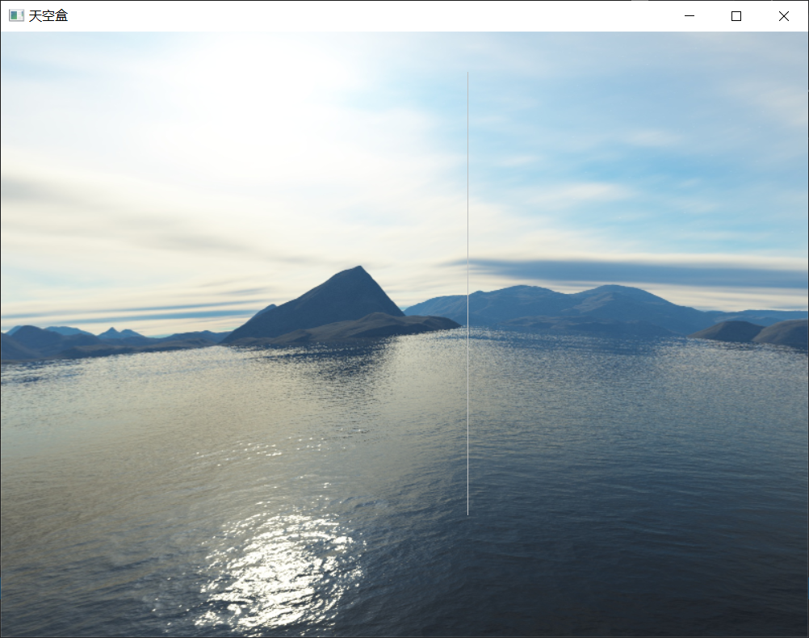

- By HHZ

  12.18

  - 地图定义见 `map.h`，除了类型外还有一个指针指向格子内的物体；有物体的格子用链表维护，绘制时遍历链表绘制每个物体
  - 目前地图坐标只支持非负，下次开会可能要讨论一下坐标的规定
  - 所有绘制的物体建议尽可能用显示列表加速，尤其是带曲面的，否则可能严重影响帧率

  12.25

  - 初步建立了菜单的框架，可能在考试后完成

- By LRC

  12.10

  - 天空盒完成，可以用test里的main函数测试

  - 效果差强人意，4条y轴方向的边能看到不协调(如下图灰线指出的地方)，但是感觉很难再改进了

    

  - 还没和HHZ的传送带拼到一起，下次开会前争取拼好

  - 改了一点`TexLoader`类，加了几条滤波的参数，且把生成纹理的函数从`glTexImage2D`换成了`gluBuild2DMipmaps`以避免天空盒出现纹理躁动

- Contributors
  - LRC
  - HHZ